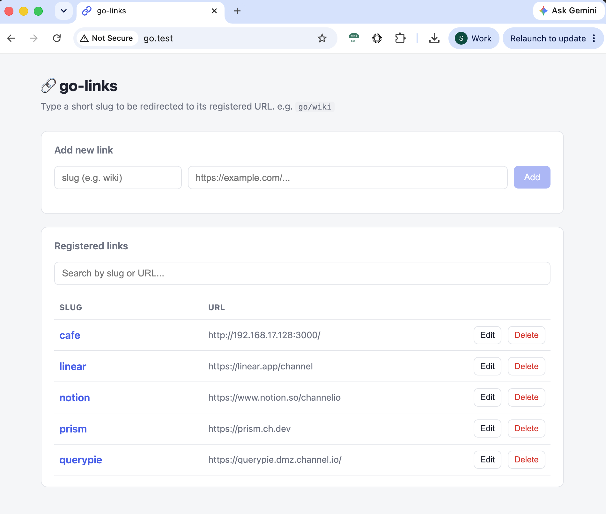

# go-links

Internal shortlink server — type `go.test/anything` in your browser and land wherever you want!

- Manage links at `http://go.test`.
- Type `go.test/<slug>` in your browser to redirect (e.g., `go.test/querypie` or `go.test/cafe`).
- Built with **Node.js + Express**. Link data is stored in a plain `links.json` file.

## Features

- `GET /:slug` → 302 redirect to the registered URL (`404` if not found)
- `GET /` → web UI to manage links
- `POST /api/links` `{ slug, url }` → add a link (`409` if slug already exists)
- `PUT /api/links/:slug` `{ url }` → update a link
- `DELETE /api/links/:slug` → delete a link
- Live search, duplicate-slug checking, and inline editing
- `links.json` is created automatically on first run

## Requirements

- Node.js 18 or newer (`brew install node`)

## Setup (macOS, local)

**1. Install dependencies**

```bash
npm install
```

**2. Map `go.test` to localhost**

```bash
echo "127.0.0.1   go.test" | sudo tee -a /etc/hosts
```

**3. Add a shell alias** (add to `~/.zshrc`)

```bash
alias start-golinks='sudo PORT=80 node /Users/YOUR_USERNAME/Downloads/go-links/server.js'
```

```bash
source ~/.zshrc
```

**4. Start the server**

```bash
start-golinks
```

Manage links at `http://go.test`. Type `go.test/slug` in your browser to redirect.

> This runs locally on your machine only. Company-wide setup is not included here.

## API

```bash
# Add
curl -X POST http://go.test/api/links \
  -H 'Content-Type: application/json' \
  -d '{"slug":"wiki","url":"https://notion.so/..."}'

# Update
curl -X PUT http://go.test/api/links/wiki \
  -H 'Content-Type: application/json' \
  -d '{"url":"https://new-url.com"}'

# Delete
curl -X DELETE http://go.test/api/links/wiki
```

## Data format

`links.json` is a flat object of `slug → url`:

```json
{
  "vpn": "https://notion.so/...",
  "hr": "https://notion.so/...",
  "figma": "https://figma.com/..."
}
```